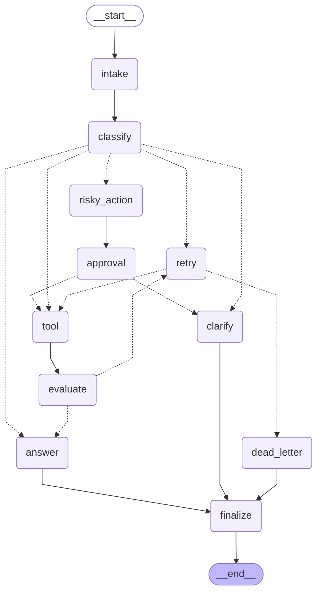

# Day 08 Lab Report

## 1. Team / student

- Name: Tran Ngoc Huy
- Repo/commit: local working tree
- Date: 2026-05-11

## 2. Architecture

The workflow is a LangGraph `StateGraph` for a support-ticket agent. The graph starts at `intake`, classifies the normalized query, then routes to one of five paths:

- `simple`: answer directly, then finalize.
- `tool`: call the mock tool, evaluate the result, answer, then finalize.
- `missing_info`: ask a clarification question, then finalize.
- `risky`: prepare a proposed risky action, require approval, then continue to tool/evaluate/answer if approved.
- `error`: enter the retry path, call the tool, evaluate, and either retry or dead-letter.

Retry is controlled by the `evaluate -> retry -> tool` loop. `evaluate_node` sets `evaluation_result` to `needs_retry` when the latest tool result contains an error. `retry_or_fallback_node` increments `attempt`, and `route_after_retry` sends the request back to `tool` only while `attempt < max_attempts`; otherwise it goes to `dead_letter`.

All terminal paths end at `finalize -> END`.

## 3. State schema

| Field | Reducer | Why |
|---|---|---|
| `thread_id` | overwrite | Stable run identifier for checkpointing and recovery |
| `scenario_id` | overwrite | Scenario identity for metrics |
| `query` | overwrite | Normalized user query |
| `route` | overwrite | Current route decision |
| `risk_level` | overwrite | Latest risk classification |
| `attempt` | overwrite | Current retry attempt count |
| `max_attempts` | overwrite | Retry bound from scenario config |
| `final_answer` | overwrite | Final response or fallback message |
| `pending_question` | overwrite | Clarification question when information is missing |
| `proposed_action` | overwrite | Risky action awaiting approval |
| `approval` | overwrite | Human/mock approval decision |
| `evaluation_result` | overwrite | Gate for `evaluate -> retry/answer` routing |
| `messages` | append | Audit conversation/intake trace |
| `tool_results` | append | Preserve tool evidence across retries |
| `errors` | append | Preserve retry/failure history |
| `events` | append | Node-level audit trail used by metrics and report |

## 4. Scenario results

Metrics source: `outputs/metrics.json`.

| Scenario | Expected route | Actual route | Success | Retries | Interrupts |
|---|---|---|---:|---:|---:|
| S01_simple | simple | simple | true | 0 | 0 |
| S02_tool | tool | tool | true | 0 | 0 |
| S03_missing | missing_info | missing_info | true | 0 | 0 |
| S04_risky | risky | risky | true | 0 | 1 |
| S05_error | error | error | true | 2 | 0 |
| S06_delete | risky | risky | true | 0 | 1 |
| S07_dead_letter | error | error | true | 1 | 0 |

Summary:

- Total scenarios: 7
- Success rate: 100.00%
- Average nodes visited: 6.43
- Total retries: 3
- Total interrupts: 2
- Crash-resume/state-history success: true

The retry count is 3 because `S05_error` retries twice before success, while `S07_dead_letter` has `max_attempts=1` and goes to dead letter after one retry. The interrupt count is 2 because both risky sample scenarios require approval.

## 5. Failure analysis

1. Retry or tool failure: error-route scenarios simulate transient tool failures by returning tool results containing `ERROR`. `evaluate_node` marks these as `needs_retry`, and routing sends them through `retry_or_fallback_node`. The loop is bounded by `max_attempts`, so it cannot run forever.

2. Max retry exhausted: `S07_dead_letter` sets `max_attempts=1`. After the first retry is recorded, `route_after_retry` sends the workflow to `dead_letter`, and the graph still terminates through `finalize`.

3. Risky action without approval: risky routes must pass through `approval_node`. In mock mode approval is granted for CI. In real HITL demo mode, `interrupt()` pauses the graph. Approved decisions continue to `tool`; rejected decisions route to `clarify`.

## 6. Persistence / recovery evidence

The lab uses SQLite checkpointing in `configs/lab.yaml`:

```yaml
checkpointer: sqlite
database_url: outputs/checkpoints-bonus.db
```

Evidence:

- SQLite checkpoint database was created at `outputs/checkpoints-bonus.db`.
- Each scenario run gets a unique `thread_id` suffix so repeated runs do not resume stale checkpoints.
- Crash-resume is verified by creating a new graph/checkpointer with the same SQLite DB, then reading `get_state_history(config)` for the same `thread_id`.
- `outputs/metrics.json` has `resume_success: true`.

Time-travel replay evidence from `outputs/time_travel_replay.json`:

| Step | Node | Route | Attempt | Events |
|---:|---|---|---:|---:|
| 0 | start | null | null | 0 |
| 1 | start |  | 0 | 0 |
| 2 | intake |  | 0 | 1 |
| 3 | classify | simple | 0 | 2 |
| 4 | answer | simple | 0 | 3 |
| 5 | finalize | simple | 0 | 4 |

## 7. Extension work

Completed extensions:

- SQLite persistence with `SqliteSaver(conn=sqlite3.connect(...))`.
- Crash-resume evidence using the same SQLite DB and same `thread_id`.
- Time-travel replay exported to `outputs/time_travel_replay.json`.
- Real HITL interrupt demo exported to `outputs/hitl_demo.json` and `outputs/hitl_demo_rejected.json`.
- Mermaid graph diagram exported to `outputs/graph_diagram.mmd`.

HITL approved path:

- Interrupt payload includes `proposed_action` and `risk_level`.
- Human decision: approved by `demo-human`.
- Visited nodes: `intake -> classify -> risky_action -> approval -> tool -> evaluate -> answer -> finalize`.

HITL rejected path:

- Human decision: rejected by `demo-human`.
- Visited nodes: `intake -> classify -> risky_action -> approval -> clarify -> finalize`.

Graph diagram:



## 8. Improvement plan

With one more day, I would productionize these areas first:

- Replace keyword classification with a structured classifier and explicit confidence.
- Replace string-based tool errors with typed tool result objects.
- Add persistent dead-letter storage with owner, timestamp, and replay instructions.
- Add a small approval UI for real human review instead of CLI-only HITL demo.
- Add observability fields such as real latency, run id, checkpoint id, and structured error codes.
